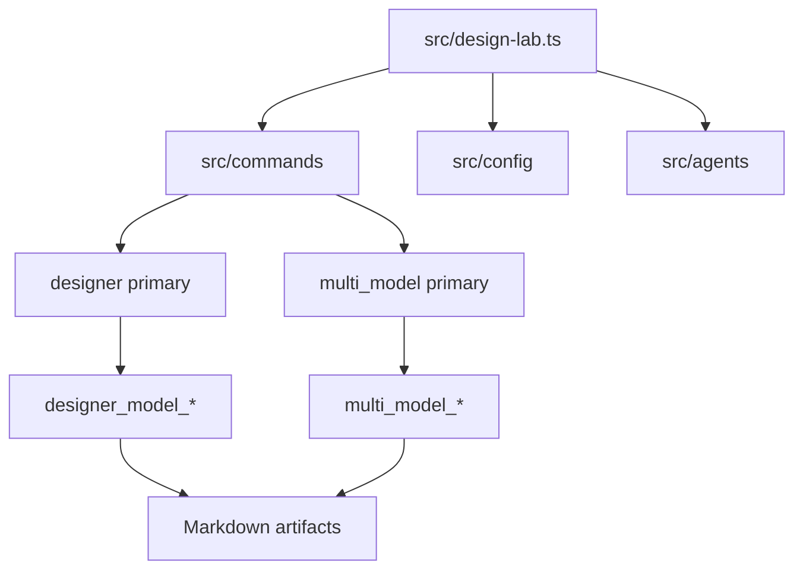
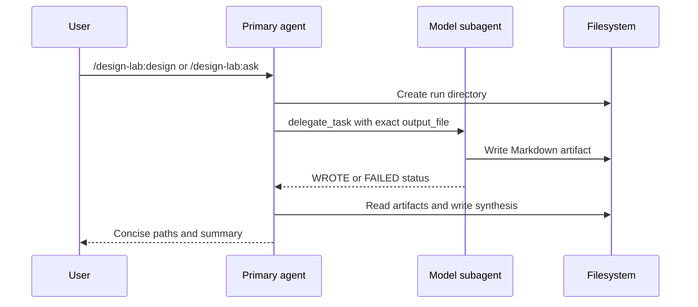

# Architecture

<cite>
**Referenced Files in This Document**
- [README.md](file://README.md)
- [DESIGN.md](file://DESIGN.md)
- [PRD.md](file://PRD.md)
- [src/design-lab.ts](file://src/design-lab.ts)
- [src/agents/index.ts](file://src/agents/index.ts)
- [src/commands/index.ts](file://src/commands/index.ts)
- [src/tools/index.ts](file://src/tools/index.ts)
- [src/tools/generate-designs.ts](file://src/tools/generate-designs.ts)
- [src/tools/review-designs.ts](file://src/tools/review-designs.ts)
- [src/tools/aggregate-scores.ts](file://src/tools/aggregate-scores.ts)
- [src/utils/session-helpers.ts](file://src/utils/session-helpers.ts)
- [.journal/2026-05-03-1706.md](file://.journal/2026-05-03-1706.md)
</cite>

## Table of Contents

1. [Architectural Pattern](#architectural-pattern)
2. [Plugin Registration](#plugin-registration)
3. [Agent Topology](#agent-topology)
4. [File-First Data Flow](#file-first-data-flow)
5. [Legacy Tool Boundary](#legacy-tool-boundary)

## Architectural Pattern

The current architecture is an OpenCode plugin with command-driven agent
orchestration. Commands provide task templates, primary agents coordinate the
workflow, and subagents execute model-specific file-writing tasks. This differs
from the original PRD's stricter plugin-controlled orchestration: current runtime
behavior relies on OpenCode `delegate_task` and primary-agent prompts for
orchestration, blind setup, failure classification, and synthesis.

**Diagram sources**

- [src/design-lab.ts](file://src/design-lab.ts#L31-L117)
- [src/commands/index.ts](file://src/commands/index.ts#L77-L245)
- [src/agents/index.ts](file://src/agents/index.ts#L69-L186)

**Section sources**

- [PRD.md](file://PRD.md#L44-L78)
- [DESIGN.md](file://DESIGN.md#L56-L76)
- [DESIGN.md](file://DESIGN.md#L227-L231)
- [src/agents/index.ts](file://src/agents/index.ts#L338-L390)

## Plugin Registration

The exported `DesignLab` plugin returns a `config` hook. That hook registers all
slash commands unconditionally, then attempts to load the plugin config. When the
config loads, it normalizes model entries, deduplicates models, builds design and
review specs, builds ask specs, and registers the `designer`, `multi_model`,
`designer_model_*`, and `multi_model_*` agents.

If no config is found, commands remain available and the plugin logs a warning.
This lets `/design-lab:init` create the config file and lets command templates
report clear config-not-found messages instead of disappearing entirely.

**Section sources**

- [src/design-lab.ts](file://src/design-lab.ts#L31-L48)
- [src/design-lab.ts](file://src/design-lab.ts#L50-L117)
- [src/design-lab.ts](file://src/design-lab.ts#L131-L135)
- [.journal/2026-05-03-1706.md](file://.journal/2026-05-03-1706.md#L14-L20)

## Agent Topology

There are two primary-agent families. The `designer` primary handles design,
review, synthesis, blind review, and iterative revisions. The `multi_model`
primary handles arbitrary prompt fan-out and synthesis. Each primary agent lists
the exact subagents it can call in its generated prompt, including model,
variant, agent name, and target file stem.

Subagent names are deterministic. Designer subagents use the
`designer_model_` prefix and generic ask subagents use the `multi_model_` prefix.
Both derive suffixes from the model short name by slug normalization and hyphen
removal.

**Section sources**

- [src/agents/index.ts](file://src/agents/index.ts#L6-L67)
- [src/agents/index.ts](file://src/agents/index.ts#L69-L186)
- [src/agents/index.ts](file://src/agents/index.ts#L218-L271)
- [src/agents/index.ts](file://src/agents/index.ts#L274-L487)
- [src/agents/index.ts](file://src/agents/index.ts#L573-L586)

## File-First Data Flow

The dominant runtime contract is file-first output. Primary agents create run
directories and pass exact output paths to subagents. Subagents must write their
full work to those paths and keep chat output minimal. This keeps large design,
review, and response artifacts out of the main conversation context.

**Diagram sources**

- [src/agents/index.ts](file://src/agents/index.ts#L188-L215)
- [src/agents/index.ts](file://src/agents/index.ts#L236-L271)
- [src/agents/index.ts](file://src/agents/index.ts#L392-L487)
- [src/commands/index.ts](file://src/commands/index.ts#L77-L245)

**Section sources**

- [README.md](file://README.md#L116-L167)
- [DESIGN.md](file://DESIGN.md#L41-L55)
- [src/agents/index.ts](file://src/agents/index.ts#L188-L215)
- [src/agents/index.ts](file://src/agents/index.ts#L479-L487)

## Legacy Tool Boundary

The repository still exports direct tool factories under `src/tools/`. These
tools create OpenCode sessions directly with helpers, parse JSON, validate Zod
schemas, and write JSON/Markdown files. The current plugin entrypoint does not
register these tools; instead, it registers slash commands and agents. Treat the
tool factories as legacy or alternate orchestration primitives unless they are
explicitly wired back into the plugin.

**Section sources**

- [src/tools/index.ts](file://src/tools/index.ts#L1-L3)
- [src/tools/generate-designs.ts](file://src/tools/generate-designs.ts#L30-L204)
- [src/tools/review-designs.ts](file://src/tools/review-designs.ts#L26-L174)
- [src/tools/aggregate-scores.ts](file://src/tools/aggregate-scores.ts#L15-L155)
- [src/utils/session-helpers.ts](file://src/utils/session-helpers.ts#L17-L89)
- [src/design-lab.ts](file://src/design-lab.ts#L37-L117)
