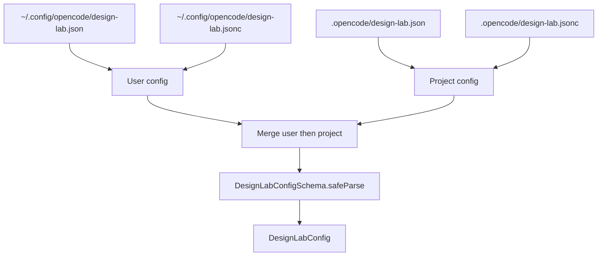

# Configuration

<cite>
**Referenced Files in This Document**
- [README.md](file://README.md)
- [package.json](file://package.json)
- [src/config/schema.ts](file://src/config/schema.ts)
- [src/config/loader.ts](file://src/config/loader.ts)
- [src/config/loader.test.ts](file://src/config/loader.test.ts)
- [src/agents/index.ts](file://src/agents/index.ts)
- [src/design-lab.ts](file://src/design-lab.ts)
- [src/commands/index.ts](file://src/commands/index.ts)
- [src/commands/index.test.ts](file://src/commands/index.test.ts)
- [src/utils/schema-export.ts](file://src/utils/schema-export.ts)
- [schemas/design-lab-config.schema.json](file://schemas/design-lab-config.schema.json)
</cite>

## Table of Contents

1. [Schema Model](#schema-model)
2. [Model Entries and Variants](#model-entries-and-variants)
3. [Config Discovery and Merge](#config-discovery-and-merge)
4. [Runtime Consumers](#runtime-consumers)
5. [Generated JSON Schema](#generated-json-schema)

## Schema Model

The Zod schema defines one required model list and several optional fields. The
required field is `design_models`, which must contain at least two model entries.
`review_models` and `ask_models` are optional. `base_output_dir`,
`design_agent_temperature`, and `review_agent_temperature` have defaults, and
`topic_generator_model` is reserved for future behavior.

| Field                      | Required | Default                          | Purpose                                       |
| -------------------------- | -------- | -------------------------------- | --------------------------------------------- |
| `design_models`            | yes      | none                             | Models used for independent design proposals. |
| `review_models`            | no       | `design_models`                  | Models used for comparative reviews.          |
| `ask_models`               | no       | `design_models`                  | Models used for general multi-model prompts.  |
| `base_output_dir`          | no       | `.design-lab`                    | Root output directory for runs.               |
| `design_agent_temperature` | no       | `0.7`                            | Reserved design temperature setting.          |
| `review_agent_temperature` | no       | `0.1`                            | Reserved review temperature setting.          |
| `topic_generator_model`    | no       | first design model by convention | Reserved topic generation model.              |

**Section sources**

- [src/config/schema.ts](file://src/config/schema.ts#L23-L75)
- [README.md](file://README.md#L79-L100)
- [src/config/loader.test.ts](file://src/config/loader.test.ts#L75-L90)
- [src/config/loader.test.ts](file://src/config/loader.test.ts#L199-L220)

## Model Entries and Variants

Each model entry is either a plain string or an object with `model` and
`variant`. Plain strings normalize to `{ model, variant: "max" }`. Object entries
default `variant` to `max` at Zod/runtime level when omitted by TypeScript/Zod
parsing, but the generated JSON Schema currently lists `variant` as required
inside object entries. Consumers relying on the JSON Schema should provide
`variant` explicitly until that schema behavior is intentionally changed.

```typescript
type ModelConfig =
  | string
  | {
      model: string;
      variant?: "low" | "medium" | "high" | "max";
    };
```

**Section sources**

- [src/config/schema.ts](file://src/config/schema.ts#L3-L18)
- [src/agents/index.ts](file://src/agents/index.ts#L55-L67)
- [README.md](file://README.md#L68-L100)
- [schemas/design-lab-config.schema.json](file://schemas/design-lab-config.schema.json#L17-L33)
- [schemas/design-lab-config.schema.json](file://schemas/design-lab-config.schema.json#L73-L89)

## Config Discovery and Merge

The config loader checks project-level config first in path order, then
user-level config in path order. Loading behavior then merges user config first
and project config second, so project fields override user fields. Both `.json`
and `.jsonc` are supported, and JSONC parsing strips block comments plus
line-leading `//` comments before JSON parsing.



**Diagram sources**

- [src/config/loader.ts](file://src/config/loader.ts#L37-L47)
- [src/config/loader.ts](file://src/config/loader.ts#L58-L100)
- [src/config/loader.ts](file://src/config/loader.ts#L115-L222)

**Section sources**

- [src/config/loader.ts](file://src/config/loader.ts#L37-L47)
- [src/config/loader.ts](file://src/config/loader.ts#L58-L100)
- [src/config/loader.ts](file://src/config/loader.ts#L115-L222)
- [src/config/loader.test.ts](file://src/config/loader.test.ts#L46-L59)
- [src/config/loader.test.ts](file://src/config/loader.test.ts#L92-L197)

## Runtime Consumers

Plugin registration calls `loadPluginConfig(ctx.directory)` and uses the merged
validated result to register agents. Command templates, however, instruct the
primary agents to read project config paths only at command execution time. This
is an intentional current behavior in tests that keeps command config access
inside the project workspace, but it means user-level config can affect plugin
agent registration while command instructions may still tell agents to ignore
user config at runtime.

**Section sources**

- [src/design-lab.ts](file://src/design-lab.ts#L33-L64)
- [src/design-lab.ts](file://src/design-lab.ts#L104-L117)
- [src/commands/index.ts](file://src/commands/index.ts#L86-L97)
- [src/commands/index.ts](file://src/commands/index.ts#L117-L143)
- [src/commands/index.test.ts](file://src/commands/index.test.ts#L26-L41)

## Generated JSON Schema

`bun run export-schemas` runs `src/utils/schema-export.ts`, which converts the
Zod schemas to JSON Schema files under `schemas/`. The config schema is intended
for IDE validation through the `$schema` URL included in the init template and
README examples.

**Section sources**

- [package.json](file://package.json#L20-L28)
- [src/utils/schema-export.ts](file://src/utils/schema-export.ts#L16-L44)
- [src/commands/index.ts](file://src/commands/index.ts#L33-L67)
- [README.md](file://README.md#L58-L66)
- [schemas/design-lab-config.schema.json](file://schemas/design-lab-config.schema.json#L1-L120)
