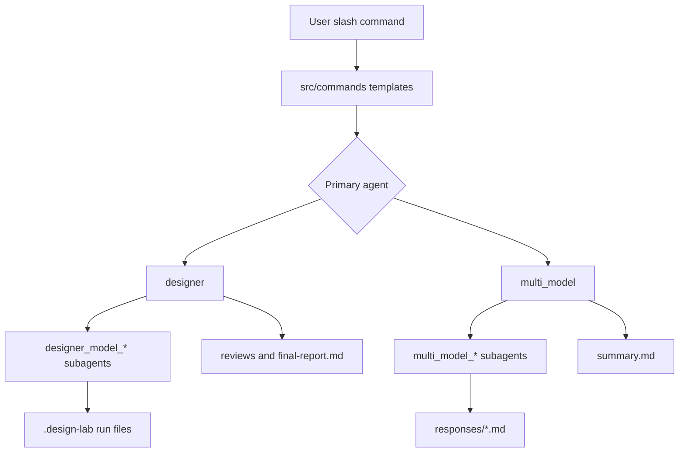

# System Overview

<cite>
**Referenced Files in This Document**
- [README.md](file://README.md)
- [DESIGN.md](file://DESIGN.md)
- [PRD.md](file://PRD.md)
- [package.json](file://package.json)
- [src/design-lab.ts](file://src/design-lab.ts)
- [src/agents/index.ts](file://src/agents/index.ts)
- [src/commands/index.ts](file://src/commands/index.ts)
- [src/config/schema.ts](file://src/config/schema.ts)
- [src/config/loader.ts](file://src/config/loader.ts)
- [.journal/2026-05-03-1706.md](file://.journal/2026-05-03-1706.md)
- [.journal/2026-05-05.md](file://.journal/2026-05-05.md)
- [docs/superpowers/plans/2026-06-02-general-multi-model-ask.md](file://docs/superpowers/plans/2026-06-02-general-multi-model-ask.md)
</cite>

## Table of Contents

1. [Purpose](#purpose)
2. [Runtime Shape](#runtime-shape)
3. [Core Capabilities](#core-capabilities)
4. [Major Components](#major-components)
5. [Current Working Tree Notes](#current-working-tree-notes)

## Purpose

OpenCode Design Lab is an OpenCode plugin for model-comparative design work. It
creates model-specific agents from configuration, asks those agents to generate
independent design proposals, and then orchestrates reviews and synthesis through
file-backed artifacts. The product requirement is broader than code generation:
designs are treated as first-class artifacts that can be compared, reviewed, and
ranked reproducibly.

**Updated: 2026-06-02** - This wiki was generated from the current working tree
and includes the general multi-model `/design-lab:ask` workflow in addition to
the design, review, synthesis, journal, and repowiki commands.

**Section sources**

- [README.md](file://README.md#L1-L27)
- [DESIGN.md](file://DESIGN.md#L16-L33)
- [PRD.md](file://PRD.md#L5-L18)
- [docs/superpowers/plans/2026-06-02-general-multi-model-ask.md](file://docs/superpowers/plans/2026-06-02-general-multi-model-ask.md#L5-L9)

## Runtime Shape

The plugin entry point registers slash commands on every load. If a valid
configuration is present, it also registers primary agents and model-specific
subagents derived from `design_models`, `review_models`, and `ask_models`. The
primary agents coordinate work through OpenCode agent delegation, while subagents
write full outputs to files and return short status messages.

**Diagram sources**

- [src/design-lab.ts](file://src/design-lab.ts#L31-L117)
- [src/agents/index.ts](file://src/agents/index.ts#L69-L186)
- [src/commands/index.ts](file://src/commands/index.ts#L71-L245)

**Section sources**

- [src/design-lab.ts](file://src/design-lab.ts#L31-L117)
- [src/agents/index.ts](file://src/agents/index.ts#L69-L186)
- [src/commands/index.ts](file://src/commands/index.ts#L71-L245)

## Core Capabilities

The design workflow emphasizes dynamic model mapping, file-first outputs,
per-model reasoning variants, isolated design generation, double-blind review,
and failure-aware delegation. The general ask workflow adds a fan-out/fan-in path
for arbitrary prompts: every configured ask model receives the same prompt, writes
its own response file, and the `multi_model` primary agent writes the synthesis.

The review workflow is intentionally blind. After designs are generated, the
primary agent creates anonymous copies under `blinds/designs-blind/`, writes the
private mapping to `blinds/mapping.json`, and instructs reviewers to evaluate
anonymous labels only. Final summaries de-anonymize with the mapping so the user
sees real model names without exposing them to review subagents.

**Section sources**

- [README.md](file://README.md#L8-L15)
- [DESIGN.md](file://DESIGN.md#L23-L33)
- [DESIGN.md](file://DESIGN.md#L196-L205)
- [src/agents/index.ts](file://src/agents/index.ts#L188-L271)
- [src/agents/index.ts](file://src/agents/index.ts#L312-L487)
- [.journal/2026-05-05.md](file://.journal/2026-05-05.md#L11-L33)

## Major Components

The repository is a single TypeScript/Bun plugin package. Its primary source
modules are:

| Area                | Role                                                                                                |
| ------------------- | --------------------------------------------------------------------------------------------------- |
| `src/design-lab.ts` | OpenCode plugin entry point; registers commands and agents.                                         |
| `src/commands/`     | Slash-command templates for init, ask, design, review, synthesize, repowiki, and journal.           |
| `src/agents/`       | Agent factories, model normalization, naming, prompts, blind review, and general ask orchestration. |
| `src/config/`       | Zod schemas and JSON/JSONC config loader with project/user merge behavior.                          |
| `src/tools/`        | Older direct tool factories that use OpenCode session helpers and structured schema validation.     |
| `src/utils/`        | Logging, schema export, lab directory helpers, and legacy session helpers.                          |

The package builds from `src/design-lab.ts` to `.opencode/plugins/design-lab.js`,
which is the plugin file published by the package.

**Section sources**

- [package.json](file://package.json#L2-L28)
- [src/design-lab.ts](file://src/design-lab.ts#L1-L23)
- [src/commands/index.ts](file://src/commands/index.ts#L16-L365)
- [src/agents/index.ts](file://src/agents/index.ts#L34-L186)
- [src/config/schema.ts](file://src/config/schema.ts#L23-L149)
- [src/config/loader.ts](file://src/config/loader.ts#L129-L222)

## Current Working Tree Notes

Recent project work added the `/design-lab:ask` command, `ask_models` config,
generic `multi_model` agents, focused Vitest discovery, and README/DESIGN updates.
Earlier journal entries document the move to hot-reloadable config instructions,
per-model variants, prompt-level failure detection, iterative revisions, and
double-blind review.

The current command templates instruct runtime agents to read project-level config
paths only. The plugin registration loader still supports both project-level and
user-level config with project overrides. This distinction is important when
debugging why commands and plugin registration may appear to resolve config from
different scopes.

**Section sources**

- [docs/superpowers/plans/2026-06-02-general-multi-model-ask.md](file://docs/superpowers/plans/2026-06-02-general-multi-model-ask.md#L22-L34)
- [.journal/2026-05-03-1706.md](file://.journal/2026-05-03-1706.md#L5-L49)
- [.journal/2026-05-05.md](file://.journal/2026-05-05.md#L19-L33)
- [src/commands/index.ts](file://src/commands/index.ts#L86-L97)
- [src/config/loader.ts](file://src/config/loader.ts#L115-L222)
