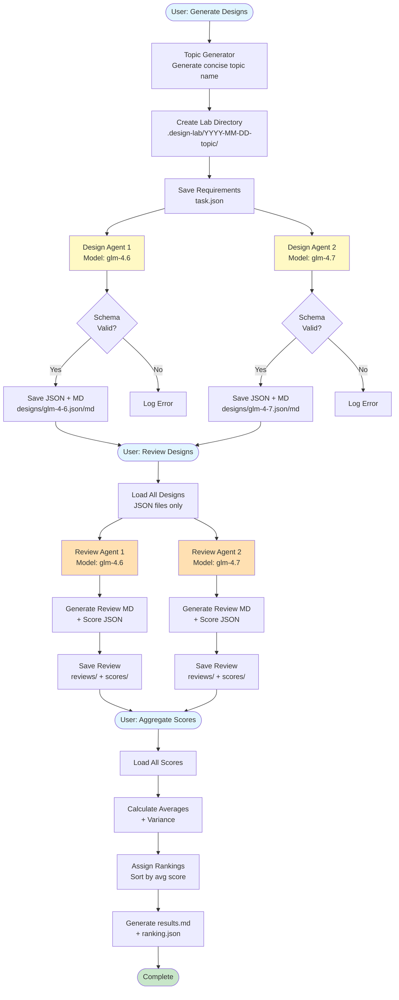

# Design Lab - Technical Design Document

## Table of Contents

1. [System Overview](#system-overview)
2. [Core Principles](#core-principles)
3. [Architecture](#architecture)
4. [Component Details](#component-details)
5. [Data Flow](#data-flow)
6. [Design Decisions](#design-decisions)
7. [Schema Specifications](#schema-specifications)
8. [Agent System Prompts](#agent-system-prompts)
9. [Session Management](#session-management)
10. [Error Handling](#error-handling)

## System Overview

OpenCode Design Lab is a systematic design exploration tool that leverages multiple AI models to generate, evaluate, and rank software design proposals. Unlike traditional chat-based design sessions, Design Lab treats design as a structured, reproducible artifact with formal evaluation criteria.

### Key Capabilities

- **Multi-Model Design Generation**: Generate independent designs from 2+ AI models
- **Structured Output**: All designs conform to a predefined JSON schema
- **Independent Evaluation**: Multiple reviewers score designs without coordination
- **Quantitative Ranking**: Aggregate scores across multiple dimensions to produce rankings
- **Reproducible Results**: Same inputs + config → same outputs

## Core Principles

### 1. Design Isolation

Each design agent operates in complete isolation:

- No access to other designs
- No coordination or discussion
- Independent reasoning from requirements

**Why**: Prevents groupthink, maximizes diversity of solutions, ensures independent thinking.

### 2. Structured Artifacts

All outputs follow strict schemas:

- `DesignArtifactSchema`: Design proposals
- `ScoreSchema`: Review scores
- `RankingSchema`: Final rankings

**Why**: Enables programmatic processing, ensures completeness, facilitates comparison.

### 3. Sequential Execution

Agents run sequentially, not in parallel:

- Design 1 → Design 2 → ... → Design N
- Review 1 → Review 2 → ... → Review M

**Why**: Avoids session conflicts, simplifies error handling, maintains deterministic ordering.

### 4. Explicit System Prompts

Every agent receives a detailed system prompt:

- Instructions on output format
- Evaluation criteria
- Required fields and constraints

**Why**: Without system prompts, models produce unstructured output, ask clarifying questions, or deviate from requirements.

## Architecture

### High-Level Flow

```
User Requirements
    ↓
Topic Generation (1 agent call)
    ↓
Directory Creation
    ↓
Design Generation (N parallel agents → N sequential sessions)
    ↓
Design Validation & Storage (JSON + Markdown)
    ↓
Review Generation (M reviewers × N designs = M sequential sessions)
    ↓
Score Extraction & Validation
    ↓
Score Aggregation (calculate averages, variance, rankings)
    ↓
Results Generation (results.md + ranking.json)
```

### Visual Workflow



### Directory Structure

```
.design-lab/
└── YYYY-MM-DD-{topic}/
    ├── task.json              # Original requirements
    ├── designs/
    │   ├── glm-4-6.json       # Design artifact (JSON)
    │   ├── glm-4-6.md         # Design artifact (Markdown)
    │   ├── glm-4-7.json
    │   └── glm-4-7.md
    ├── reviews/
    │   ├── review-glm-4-6.md  # Markdown review
    │   └── review-glm-4-7.md
    ├── scores/
    │   ├── glm-4-6-reviewed-by-glm-4-6.json
    │   ├── glm-4-7-reviewed-by-glm-4-6.json
    │   ├── glm-4-6-reviewed-by-glm-4-7.json
    │   └── glm-4-7-reviewed-by-glm-4-7.json
    └── results/
        ├── ranking.json       # Final rankings
        └── results.md         # Human-readable summary
```

## Component Details

### 1. Configuration Loader (`src/config/loader.ts`)

**Responsibilities**:

- Load user config from `~/.config/opencode/design-lab.json`
- Load project config from `.opencode/design-lab.json`
- Merge configs (project overrides user)
- Validate against `DesignLabConfigSchema`

**Key Functions**:

- `loadPluginConfig(directory: string): DesignLabConfig`
- `deepMerge(target, source)`: Recursive object merging

**Design Choice**: JSONC format allows comments in config files for better documentation.

### 2. Agent Factory (`src/agents/index.ts`)

**Responsibilities**:

- Create agent configurations with system prompts
- Define tool permissions (disable write/edit/bash for safety)
- Set temperature parameters

**Key Functions**:

- `createDesignAgent(model: string,temperature: number): AgentConfig`
- `createReviewAgent(model: string, temperature: number): AgentConfig`

**System Prompts**:

- **Design Agent**: Instructs to output structured JSON with specific sections
- **Review Agent**: Instructs to compare designs and output scores in specific format

### 3. Session Helpers (`src/utils/session-helpers.ts`)

**Responsibilities**:

- Manage OpenCode session lifecycle
- Handle async session operations with timeouts
- Extract and parse session outputs

**Key Functions**:

- `createAgentSession(ctx, parentSessionID, title, directory)`: Create session
- `sendPrompt(ctx, sessionID, prompt, tools)`: Send prompt with 180s timeout
- `pollForCompletion(ctx, sessionID)`: Wait for session idle state (10min max)
- `extractSessionOutput(ctx, sessionID)`: Extract assistant messages
- `extractJSON<T>(text)`: Parse JSON from markdown code blocks or raw text
- `getModelShortName(modelName)`: Extract model name from full path
- `sanitizeForFilename(text)`: Convert strings to safe filenames

**Critical Design: Timeouts**

- **sendPrompt**: 180s (3 minutes)
  - Allows models time to generate large JSON documents
  - Prevents infinite hangs
- **pollForCompletion**: 600s (10 minutes)
  - Checks session status every 500ms
  - Requires 3 consecutive stable message counts to confirm completion

### 4. Design Generation Tool (`src/tools/generate-designs.ts`)

**Workflow**:

1. Generate topic name from requirements
2. Create lab directory (with duplicate check)
3. Save requirements to `task.json`
4. For each design model:
   a. Create agent session with system prompt
   b. Send design prompt (system prompt + user requirements)
   c. Poll for completion
   d. Extract output and parse JSON
   e. Validate against `DesignArtifactSchema`
   f. Save as both JSON and Markdown
5. Return summary of results

**Key Design Decisions**:

- **Sequential execution**: Prevents session conflicts
- **Duplicate directory check**: Prevents infinite retry loops
- **Both JSON and MD**: JSON for processing, MD for human readability
- **Short model names**: `glm-4-6` instead of `zhipuai-coding-plan/glm-4-6`

### 5. Review Tool (`src/tools/review-designs.ts`)

**Workflow**:

1. Find most recent lab directory
2. Load all `.json` design files (ignore `.md` files)
3. Load requirements from `task.json`
4. For each review model:
   a. Create review agent session
   b. Format all designs with IDs for review
   c. Send review prompt
   d. Extract markdown review
   e. Send follow-up prompt for JSON scores
   f. Extract and validate scores against `ScoreSchema`
   g. Save review markdown and score JSON files
5. Return summary of reviews

**Critical Fix: Explicit Design IDs**
The scores prompt explicitly lists valid design IDs:

```typescript
const designIds = Object.keys(designs);
const scoresPrompt = `...
**IMPORTANT**: The "design_id" field MUST be one of these exact values:
${designIds.map((id) => `- "${id}"`).join("\n")}
...`;
```

**Why**: Without this, AI models shortened IDs (e.g., `"glm-46"` instead of `"glm-4-6"`), causing duplicate rankings.

### 6. Aggregation Tool (`src/tools/aggregate-scores.ts`)

**Workflow**:

1. Find most recent lab directory
2. Load all score JSON files
3. Group scores by design ID
4. For each design:
   a. Calculate average score for each dimension
   b. Calculate overall average
   c. Calculate variance across reviewers
   d. Count reviewers
5. Sort by average score (descending)
6. Assign ranks
7. Generate `results.md` with tables and analysis
8. Save `ranking.json` for programmatic access

**Output Format**:

- Summary table with ranks and scores
- Detailed score breakdown by dimension
- Reviewer × Design matrix
- Strengths and weaknesses for each design

### 7. Logger (`src/utils/logger.ts`)

**Configuration**:

- Uses `pino` for structured logging
- Outputs to `design-lab.log` in current directory
- Configurable log level via `LOG_LEVEL` env var
- Includes timestamps and structured data

**Usage Pattern**:

```typescript
logger.info({ model, sessionID }, "Starting design generation");
logger.error({ error: err.message }, "Design generation failed");
```

## Data Flow

### Design Generation Flow

```
Requirements (String)
    ↓
Topic Generator Agent Session
    ↓
Topic Name (String) → sanitized → Directory Name
    ↓
Create Directories (designs/, reviews/, scores/, results/)
    ↓
Save Requirements → task.json
    ↓
For Each Design Model:
    ↓
    Create Agent Session
    ↓
    Send Prompt (System Prompt + Requirements)
    ↓
    Poll for Completion (wait for idle + stable message count)
    ↓
    Extract Session Output (assistant messages)
    ↓
    Parse JSON (extract from code blocks or raw text)
    ↓
    Validate Schema (DesignArtifactSchema)
    ↓
    Save JSON (designs/{model}.json)
    ↓
    Format as Markdown
    ↓
    Save Markdown (designs/{model}.md)
```

### Review Flow

````
Load Designs (JSON files only)
    ↓
Load Requirements (task.json)
    ↓
For Each Review Model:
    ↓
    Create Review Agent Session
    ↓
    Format Designs (## Design: {id}\n\n```json\n{design}\n```)
    ↓
    Send Review Prompt (System Prompt + Designs + Requirements)
    ↓
    Extract Markdown Review
    ↓
    Save Review (reviews/review-{model}.md)
    ↓
    Send Scores Prompt (with explicit design_id list)
    ↓
    Extract JSON Scores
    ↓
    For Each Score:
        ↓
        Validate Schema (ScoreSchema)
        ↓
        Save Score (scores/{design}-reviewed-by-{reviewer}.json)
````

### Aggregation Flow

```
Load All Score Files
    ↓
Group by Design ID
    ↓
For Each Design:
    ↓
    Extract Scores from All Reviewers
    ↓
    Calculate Averages (clarity, feasibility, scalability, maintainability, completeness, overall)
    ↓
    Calculate Variance
    ↓
    Count Reviewers
    ↓
    Create Ranking Object
    ↓
Sort Rankings by Average Score (Descending)
    ↓
Assign Rank Numbers (1, 2, 3, ...)
    ↓
Generate results.md (Markdown Tables + Analysis)
    ↓
Save ranking.json (JSON Array)
```

## Design Decisions

### 1. Why Sequential Execution?

**Decision**: Run agents sequentially, not in parallel.

**Rationale**:

- OpenCode sessions may have resource limits
- Parallel sessions could cause conflicts or rate limiting
- Sequential execution is simpler to debug
- Deterministic ordering makes results reproducible

**Trade-off**: Slower execution, but more reliable.

### 2. Why Not Pass Model to Session.create()?

**Decision**: Don't pass `agent` parameter to `session.create()`.

**Rationale**:

- OpenCode SDK types don't include `agent` field in session creation
- Forcing it with type casting is fragile
- System prompts effectively guide model behavior
- Default model works fine with proper prompting

**Alternative Considered**: Type cast and force `agent` parameter → Rejected due to SDK compatibility concerns.

### 3. Why 180s Timeout for sendPrompt?

**Decision**: Use 180-second timeout instead of 30 seconds.

**Rationale**:

- Topic generation (short output): 2-5 seconds
- Design generation (large JSON): 60-120 seconds
- Some models are slower than others
- 30s was too short, causing premature failures

**Data**: User testing showed timeouts at 30s, success at 180s.

### 4. Why Both JSON and Markdown?

**Decision**: Save designs in both formats.

**Rationale**:

- JSON: Required for schema validation and programmatic processing
- Markdown: Easier for humans to read and review
- Minimal storage cost (~2x, but designs are small)
- Improves user experience significantly

### 5. Why Explicit Design ID List in Scores Prompt?

**Decision**: List exact valid design IDs in the review scores prompt.

**Rationale**:

- Without this, AI models shortened IDs inconsistently
- "glm-46" vs "glm-4-6" vs "zhipuai-coding-planglm-46"
- Resulted in duplicate entries in rankings (4 instead of 2)
- Explicit list eliminates ambiguity

**Before**:

```typescript
"design_id": "model-name"  // Vague → AI hallucinated "glm-46"
```

**After**:

```typescript
**IMPORTANT**: The "design_id" field MUST be one of these exact values:
- "glm-4-6"
- "glm-4-7"
```

### 6. Why Load Only JSON Files in Review?

**Decision**: Filter designs to only `.json` files.

**Rationale**:

- Markdown files were being loaded as designs
- Caused duplicate reviews (4 reviews for 2 designs)
- JSON files are canonical source
- Markdown is for human consumption only

### 7. Why Short Model Names in Filenames?

**Decision**: Use `glm-4-6` instead of `zhipuai-coding-plan-glm-4-6`.

**Rationale**:

- Filenames are shorter and cleaner
- Still uniquely identify the model
- User requested this explicitly
- Provider prefix adds no value in filenames

**Implementation**: `getModelShortName()` extracts last segment after `/`.

### 8. Why Check for Duplicate Directories?

**Decision**: Return error if lab directory already exists.

**Rationale**:

- Without this, OpenCode retries created 30+ duplicate directories
- Each retry creates a new timestamped directory
- Fills disk with empty directories
- Confuses users

**Trade-off**: Must manually delete directory to retry, but prevents chaos.

## Schema Specifications

### DesignLabConfig

```typescript
{
  design_models: string[];        // Min 2, models for design generation
  review_models?: string[];       // Defaults to design_models
  base_output_dir: string;        // Default: ".design-lab"
  design_agent_temperature: number;  // 0-2, default: 0.7
  review_agent_temperature: number;  // 0-2, default: 0.1
  topic_generator_model?: string; // Defaults to design_models[0]
}
```

### DesignArtifact

```typescript
{
  title: string;
  summary: string;
  assumptions: string[];
  architecture_overview: string;
  components: Array<{
    name: string;
    description: string;
    responsibilities: string[];
  }>;
  data_flow: string;
  tradeoffs: Array<{
    aspect: string;
    options: string[];
    chosen: string;
    rationale: string;
  }>;
  risks: Array<{
    risk: string;
    impact: "low" | "medium" | "high";
    mitigation: string;
  }>;
  open_questions: string[];
}
```

### Score

```typescript
{
  design_id: string;
  reviewer_model: string;
  scores: {
    clarity: number;        // 0-10
    feasibility: number;    // 0-10
    scalability: number;    // 0-10
    maintainability: number; // 0-10
    completeness: number;   // 0-10
    overall: number;        // 0-10
  };
  justification: string;
  strengths: string[];
  weaknesses: string[];
  missing_considerations: string[];
}
```

### Ranking

```typescript
{
  design_id: string;
  rank: number; // 1, 2, 3, ...
  average_score: number;
  score_breakdown: {
    clarity: number;
    feasibility: number;
    scalability: number;
    maintainability: number;
    completeness: number;
    overall: number;
  }
  variance: number;
  reviewer_count: number;
}
```

## Agent System Prompts

### Design Agent Prompt

```
You are a senior software architect generating a design proposal for a technical system.

## Your Task

You will receive design requirements and must produce a comprehensive design document as structured JSON.

## Critical Rules

1. **Output ONLY valid JSON** - No markdown, no explanations, no code blocks, just pure JSON
2. **Follow the schema exactly** - All required fields must be present
3. **Be specific and actionable** - Avoid vague statements
4. **Consider real-world constraints** - Think about scalability, maintainability, and security
5. **Identify risks proactively** - Every design has risks, acknowledge them
6. **List open questions** - What would you need to clarify with stakeholders?

## Required Output Schema

{
  "title": "Short, descriptive title for the design",
  "summary": "2-3 paragraph executive summary of the design",
  "assumptions": ["List of assumptions you're making"],
  "architecture_overview": "High-level description of the architecture approach",
  "components": [...],
  "data_flow": "Description of how data flows through the system",
  "tradeoffs": [...],
  "risks": [...],
  "open_questions": ["Questions that need stakeholder input"]
}

Remember: Your entire response must be valid JSON. No other text.
```

### Review Agent Prompt

```
You are a senior technical reviewer evaluating software design proposals.

## Your Task

You will receive multiple design proposals for the same requirements. You must:
1. Analyze each design thoroughly
2. Compare them objectively
3. Provide scores for each design
4. Generate a markdown review with your analysis

## Scoring Criteria (0-10 scale)

- **Clarity**: How well-explained and understandable is the design?
- **Feasibility**: Can this design be realistically implemented?
- **Scalability**: Will this design handle growth well?
- **Maintainability**: Will this design be easy to maintain and evolve?
- **Completeness**: Does this design address all requirements?
- **Overall**: Your overall assessment

## Review Format

First, provide a detailed markdown review comparing all designs:
1. Executive summary of each design
2. Comparative analysis across dimensions
3. Strengths and weaknesses of each
4. Your recommendation

Then, provide a score table in markdown.

## Important

- Be objective and fair
- Support your scores with reasoning
- Consider the requirements when scoring
- Do not be biased by model names
```

## Session Management

### Session Lifecycle

1. **Create Session**
   - Parent session ID (from tool context)
   - Title (descriptive name)
   - Directory (current working directory)

2. **Send Prompt**
   - Prepend system prompt to user prompt
   - Disable dangerous tools (write, edit, bash, task, delegate_task)
   - Set 180s timeout

3. **Poll for Completion**
   - Check session status every 500ms
   - Wait for status === "idle"
   - Require 3 consecutive polls with stable message count
   - Max 10 minutes total

4. **Extract Output**
   - Get all session messages
   - Filter for role === "assistant"
   - Extract text from parts
   - Join all assistant messages

5. **Parse and Validate**
   - Extract JSON from text (handle markdown code blocks)
   - Validate against Zod schema
   - Throw descriptive errors on failure

### Timeout Strategy

**Why Two Timeouts?**

- `sendPrompt` timeout (180s): Prevents hanging on API level
- `pollForCompletion` timeout (600s): Prevents hanging on session level

**Why 180s for Sending?**

- Covers slow models and large outputs
- Fails fast enough to prevent user frustration
- Supported by user testing data

**Why 10min for Polling?**

- Extremely generous buffer
- Covers edge cases (model warming, high load, etc.)
- Rarely if ever hits this limit in practice

### Stability Detection

**Problem**: How do we know a session is truly done?

**Solution**: Require 3 consecutive polls where:

1. Session status === "idle"
2. Message count hasn't changed

**Why 3?**: Single poll could catch session mid-transition, 3 consecutive confirms stability.

## Error Handling

### Error Categories

1. **Schema Validation Errors**
   - Logged with context
   - Design generation continues with other models
   - User informed of failures in summary

2. **Session Errors**
   - Timeout errors (prompt send timeout, poll timeout)
   - Creation errors (API failures)
   - Extraction errors (no assistant messages)
   - All logged with structured data

3. **File System Errors**
   - Directory creation failures
   - File write failures
   - Permission errors
   - Propagated to user with clear messages

4. **Configuration Errors**
   - Invalid schema (missing required fields)
   - Invalid values (temperature out of range)
   - Fail fast during plugin initialization

### Error Logging Pattern

```typescript
try {
  // Operation
} catch (err) {
  const errorMsg = err instanceof Error ? err.message : String(err);
  logger.error({ model, error: errorMsg }, "Operation failed");
  throw new Error(`Failed to do X for ${model}: ${errorMsg}`);
}
```

### Recovery Strategies

- **Design generation failure**: Log and continue with remaining models
- **Review generation failure**: Log and continue with remaining reviewers
- **Aggregation failure**: Return early with error message
- **Duplicate directory**: Return error, require manual cleanup

## Future Improvements

### Performance

- **Parallel design generation**: Run design agents in parallel if OpenCode supports it
- **Streaming outputs**: Use streaming API if available for faster feedback
- **Caching**: Cache topic generation results

### Features

- **Design refinement loop**: Allow iterative improvement of designs
- **Custom scoring dimensions**: User-defined evaluation criteria
- **Export formats**: PDF, HTML, Notion, etc.
- **Design diff tool**: Compare designs side-by-side
- **Time series**: Track design evolution across multiple sessions

### Reliability

- **Automatic retries**: Retry failed operations with exponential backoff
- **Checkpointing**: Resume from last successful step
- **Incremental saves**: Save designs as they complete, not at the end

### User Experience

- **Progress indicators**: Show which model is currently generating
- **Estimated time**: Predict completion time based on historical data
- **Interactive mode**: Allow user to reject/regenerate specific designs
- **Web UI**: Dashboard for browsing results
