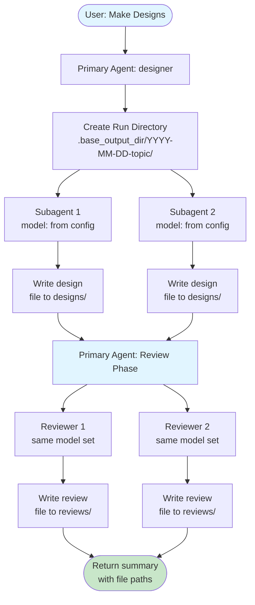

# Design Lab - Technical Design Document

## Table of Contents

1. [System Overview](#system-overview)
2. [Core Principles](#core-principles)
3. [Architecture](#architecture)
4. [Component Details](#component-details)
5. [Data Flow](#data-flow)
6. [Agent System Prompts](#agent-system-prompts)
7. [Session Management](#session-management)
8. [Error Handling](#error-handling)
9. [Configuration](#configuration)
10. [Future Improvements](#future-improvements)

## System Overview

OpenCode Design Lab is an agent-orchestrated design workflow. It registers a
primary agent that delegates design and review tasks to model-specific
subagents. Each subagent writes its output directly to Markdown files so the
primary agent does not need to ingest large artifacts into the chat context.

### Key Capabilities

- **Dynamic model registration**: Subagents are created from config at startup
- **Correct model usage**: Each subagent is bound to its configured model
- **File-first outputs**: Designs and reviews are written to disk, not chat
- **Sequential orchestration**: Subagents run one at a time for stability
- **Cross-review**: The same model set reviews all designs in a single report

## Core Principles

### 1. Dynamic Model Mapping

Agent definitions are derived from `design_models` and `review_models` in the
config. This prevents mismatches between prompts and models.

### 2. File-First Output

Designs and reviews are written directly to Markdown files. The primary agent
only returns file paths and summaries, minimizing context usage.

### 3. Design Isolation

Each design subagent works independently. It never sees other designs unless
explicitly asked to review them.

### 4. Sequential Delegation

Subagents run sequentially to avoid session conflicts and ensure deterministic
ordering.

## Architecture

### High-Level Flow

```
User Request
  ↓
Primary Agent (designer)
  ↓
Create Run Directory
  ↓
Design Delegation (N subagents, sequential)
  ↓
Design Files Written (designs/*.md)
  ↓
Review Delegation (M subagents, sequential)
  ↓
Review Files Written (reviews/*.md)
  ↓
Summary Returned (paths only)
```

### Visual Workflow



### Directory Structure

```
.design-lab/
└── YYYY-MM-DD-topic/
    ├── designs/
    │   ├── glm-4-6.md
    │   └── glm-4-7.md
    └── reviews/
        ├── review-glm-4-6.md
        └── review-glm-4-7.md
```

File stems are derived from the model short name by lowercasing and replacing
separators with hyphens (e.g., `zhipuai-coding-plan/glm-4.6` → `glm-4-6`).

## Component Details

### 1. Plugin Entry (`src/design-lab.ts`)

**Responsibilities**:

- Load `DesignLabConfig` from disk
- Register the primary agent `designer`
- Register a `designer_model_*` subagent for each configured model
- Provide consistent file naming and agent naming

### 2. Agent Factory (`src/agents/index.ts`)

**Responsibilities**:

- Create prompts for the primary agent and subagents
- Normalize model names into agent keys and file stems
- Define safe tool permissions for each agent

### 3. Configuration Loader (`src/config/loader.ts`)

**Responsibilities**:

- Load user config from `~/.config/opencode/design-lab.json(c)`
- Load project config from `.opencode/design-lab.json(c)`
- Merge configs (project overrides user)
- Validate via Zod schema

## Data Flow

### Design Flow

```
Requirements (User)
  ↓
Primary Agent
  ↓
Generate topic + run directory
  ↓
Delegate to each design subagent
  ↓
Each subagent writes designs/{model}.md
  ↓
Primary agent returns summary only
```

### Review Flow

```
Design files on disk
  ↓
Primary Agent
  ↓
Delegate to each review subagent
  ↓
Each reviewer reads all designs
  ↓
Each reviewer writes reviews/review-{model}.md
  ↓
Primary agent reads all reviews and summarizes scores and recommendation
```

## Agent System Prompts

### Primary Agent Prompt (designer)

The primary agent prompt encodes the orchestration contract:

- Create a run directory under `base_output_dir`
- Delegate design tasks to all `designer_model_*` subagents
- Delegate review tasks to the review model list
- Read all review files and summarize scores and recommendation

### Subagent Prompt (designer_model_*)

Each subagent prompt ensures file-first output:

- Write design or review Markdown to the specified path
- Do not emit the content into chat
- Respond with a minimal confirmation string
- Use the fixed scoring standard and include a scores table at the bottom of reviews

## Session Management

The plugin does not create sessions directly. The primary agent delegates tasks
via `delegate_task`, and OpenCode handles session lifecycles. The workflow is
intentionally sequential to reduce contention and make results reproducible.

## Error Handling

- Subagents report failures with `FAILED: <reason>`
- The primary agent surfaces failures in its summary
- Directory creation errors are reported immediately

## Configuration

```typescript
{
  design_models: string[];        // Min 2, models for design generation
  review_models?: string[];       // Defaults to design_models
  base_output_dir: string;        // Default: ".design-lab"
  design_agent_temperature: number;  // Reserved for future use
  review_agent_temperature: number;  // Reserved for future use
  topic_generator_model?: string; // Reserved for future use
}
```

## Future Improvements

### Reliability

- Persist requirements to `task.md` in each run directory
- Add retries for subagent failures with exponential backoff

### Features

- Optional JSON schema outputs alongside Markdown
- Aggregated score summaries from reviewer reports
- Parallel execution with rate limiting

### User Experience

- Progress indicators for each subagent step
- Optional run naming overrides and custom output directories
